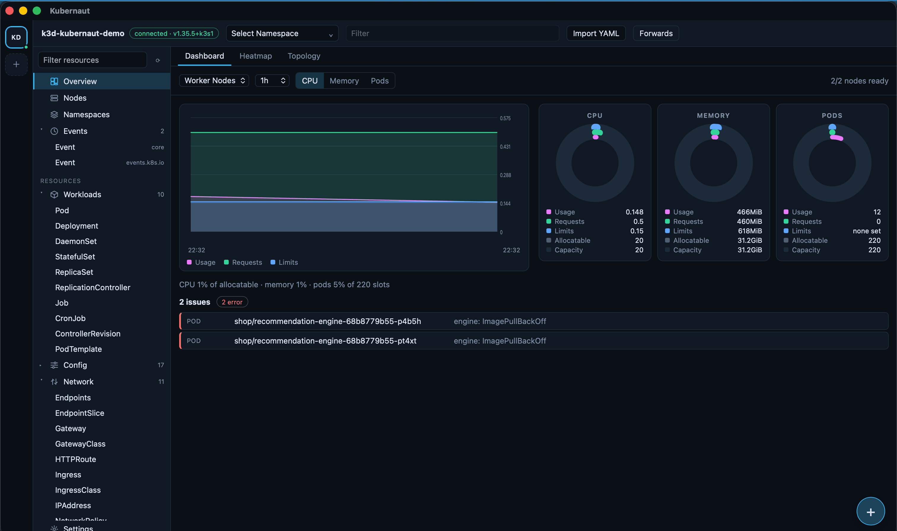
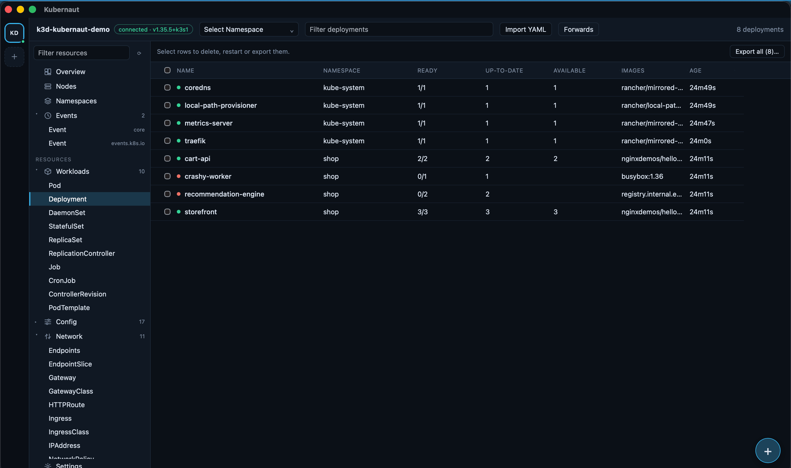
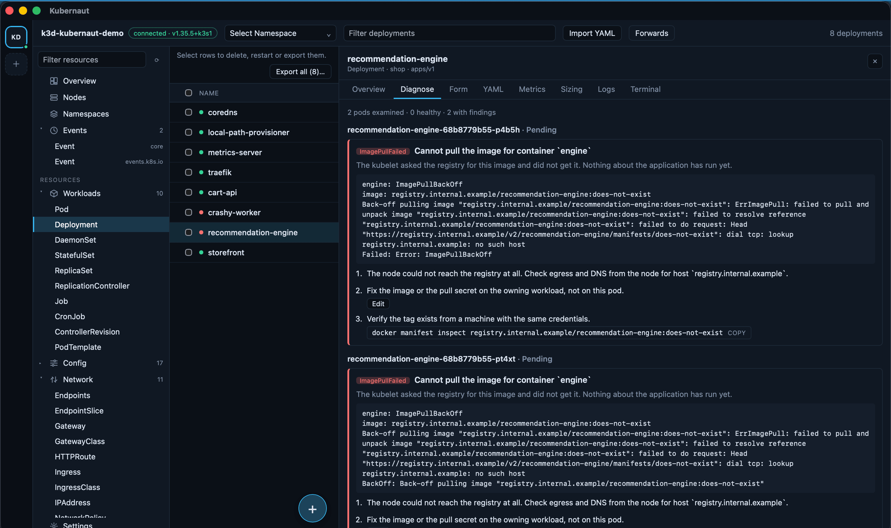
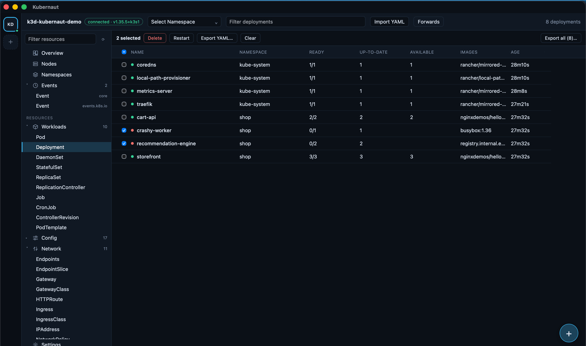
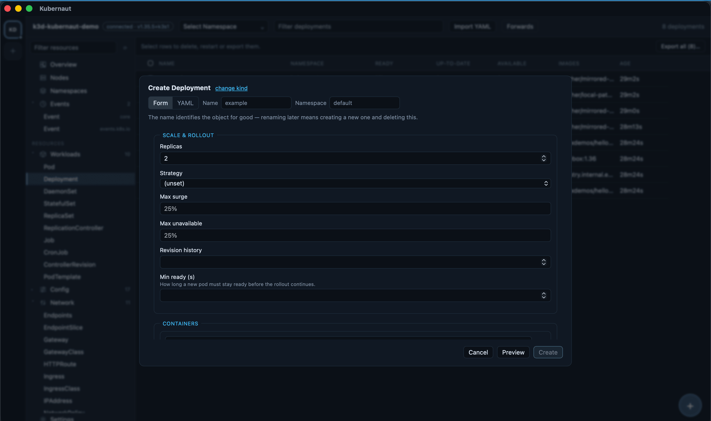
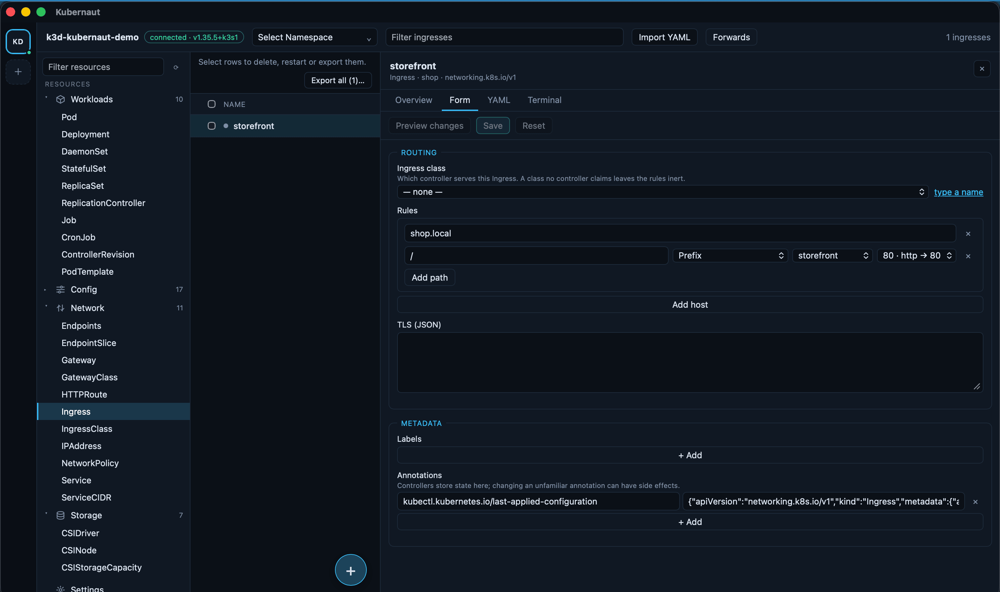
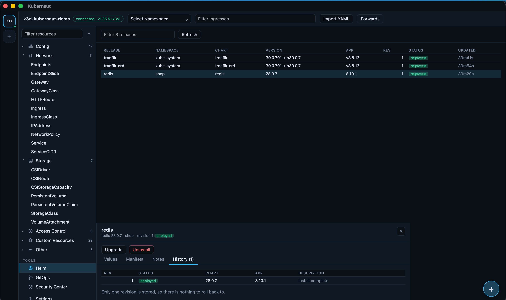
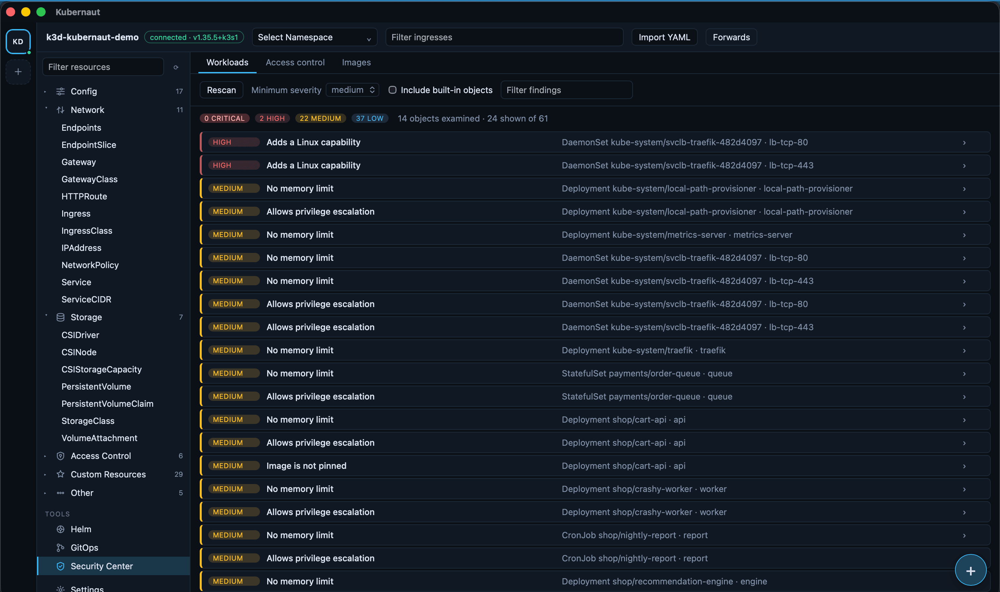
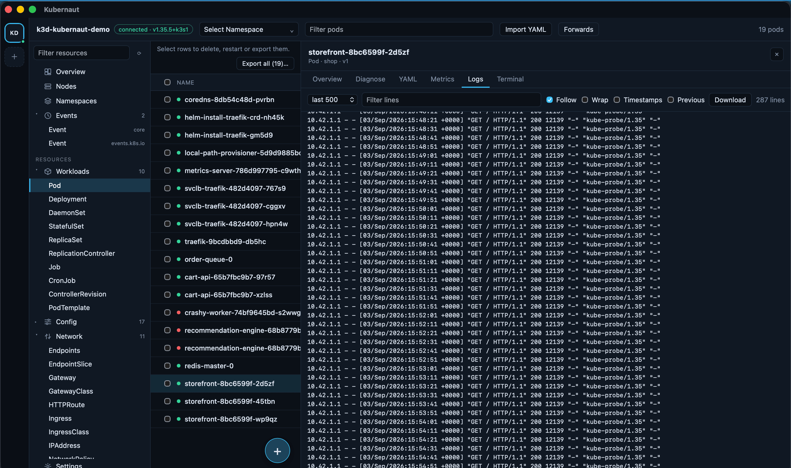
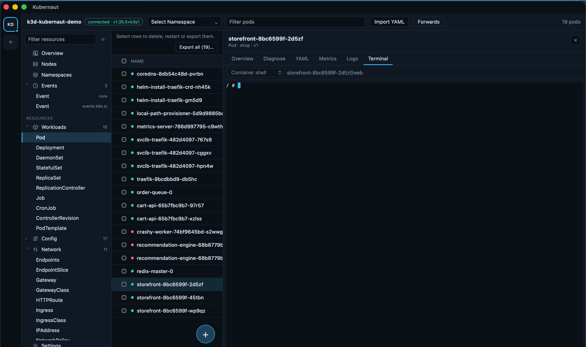

# Kubernaut

A multi-cluster Kubernetes desktop app for macOS, Windows and Linux. Rust core
(`kube-rs`) behind a Tauri v2 shell, React/TypeScript UI — built to stay usable
on clusters with thousands of objects, and to never touch a cluster you did not
explicitly add.

## Screenshots

Taken against a local [k3d](https://k3d.io) cluster, not a real one — every
name in these images is invented.

| | |
| --- | --- |
|  Cluster overview, with an issue an `ImagePullBackOff` pod put there itself |  Row selection on any resource table |
|  Diagnose: the cluster's own error, and what to do about it |  Act on a selection — delete, restart, export |
|  Create, as a form or as YAML |  Reference fields read from the cluster, not typed |
|  Every Helm release, read straight from the cluster |  Workload posture findings, no scanner required |
|  Log streaming |  A shell into the pod |

## Install

Download a build for your platform from
[Releases](https://github.com/terdiam/kubernaut/releases). macOS and Windows
builds are not code-signed (no paid developer account), so the OS will warn
before the first run:

- **macOS** — right-click the app → **Open**, or clear the quarantine flag:
  `xattr -dr com.apple.quarantine /Applications/Kubernaut.app`
- **Windows** — SmartScreen: **More info** → **Run anyway**.

Or build from source — see [Build](#build).

## Why

Kubernetes GUIs tend to break in one of two ways: they hold the entire object
list in the frontend and choke on a large cluster, or they read
`~/.kube/config` on launch and put every configured cluster one click away,
production included. Kubernaut keeps all cluster state in Rust — the UI only
ever asks for a page or subscribes to a delta stream — and starts with **no**
clusters connected; every one is added explicitly.

## Features

### Multi-cluster

- Contexts are added explicitly, from a kubeconfig file, a paste, or picked
  out of `~/.kube/config` — the app never reads that file on its own.
  Colliding context names must be renamed before import, and the underlying
  cluster/user names are qualified per import so two kubeadm clusters (both
  named `kubernetes` / `kubernetes-admin` by default) never merge into one
  credential.
- Lazy, health-probed connections (connected / degraded / unreachable), with
  login-shell `PATH` recovery so `exec` credential plugins (`aws`, `gcloud`,
  `az`, `kubelogin`) resolve even when the app is launched from Finder.
- Per-cluster display name, accent colour, impersonation, default namespace,
  proxy and TLS settings. **Protected contexts** refuse every destructive
  action outright — no dialog, no override — enforced in the command layer,
  not just the UI.

### Resource browser

- Full API discovery including CRDs, with `additionalPrinterColumns` honoured
  — a custom resource gets a real table with no app changes.
  Virtualised, sortable, resizable, with live status colouring from one shared
  vocabulary (`CrashLoopBackOff` reads red everywhere, including in CRD
  columns).
- Shared, ref-counted watches batched over a Tauri IPC channel, so many open
  tabs on the same resource cost one watch, not several.
- **Row selection** — checkbox column with select-all and shift-click ranges,
  a bulk bar for delete / restart / export, and a fuzzy command palette (⌘K)
  across clusters, resource types and live objects.

### Create, edit and import

- **Create** — a floating **+** button on every list creates that kind, as a
  form or as YAML; switching between them keeps the draft. The form walks
  through the kind's sections one at a time — a step rail up top, Back/Next
  below — rather than one long page. 16 starting templates plus a generic
  skeleton for any kind, including CRDs. Reference fields — image pull
  secrets, volumes, the governing Service on a StatefulSet, ingress backend
  service and port, ingress class, storage class, service account, node,
  priority class, HPA scale target — are read from the cluster and offered as
  selects, not typed by hand.
- **Import YAML** applies a file as it stands: server-owned fields
  (`resourceVersion`, `managedFields`, `status`, …) are stripped so an
  exported object can be re-applied, `ownerReferences` are flagged rather than
  silently dropped, and each document in a multi-document file is planned and
  applied independently — one failure does not block the rest.
- **YAML editing** in Monaco, validated against *this cluster's* own OpenAPI
  schema, with a real `dryRun=All` diff before anything is applied and
  explicit field-manager conflict reporting (with an option to take
  ownership).
- **Form editing** for common kinds over the same server-side apply path —
  only the fields that changed are sent, so an edit never claims ownership of
  the rest of the object. Secrets decode for editing and re-encode on save.
- **Bulk export** — selected rows, or everything a filter leaves visible, as a
  zip through the OS save dialog: one YAML file per object, grouped
  `<namespace>/<kind>/<name>.yaml`.

### Diagnose

A tab that reads a pod's status the way a human would, and quotes the cluster
rather than guessing: `CrashLoopBackOff`, `ImagePullFailed` (tag vs. credential
vs. network, told apart), `CreateContainerConfigError` (missing object vs.
missing key inside an object that exists), `Unschedulable` (parsed against
what the pod actually requests), `Evicted`, `OOMKilled`, node pressure, a
stuck `Terminating` finalizer, and more — each with the exact evidence and a
next step that opens straight into logs, a shell, or the editor.

### Logs and terminal

- Log streaming with a drop-oldest ring and an explicit "N lines dropped"
  marker, multi-pod tail that follows a workload's pods through a rollout, and
  a clear explanation (with whatever forensics survive) when the log file
  itself is already gone from the node.
- Four terminal modes behind one session type: container shell, ephemeral
  debug container (for images with no shell), node shell (a removable
  privileged debug pod), and a local kubectl shell pinned to a temporary
  single-context kubeconfig — it cannot reach another cluster by changing
  `--context`.
- Port forwarding bound to loopback by default, re-resolving the target pod
  per connection so a rollout does not kill the forward.

### Metrics and topology

- Cluster overview: CPU/memory/pod gauges against usage, requests, limits and
  capacity, an hour of history, and a live issues panel.
- Namespace heatmap (usage vs. declared requests), per-object metrics with
  request/limit reference lines, and node-level CPU/memory/disk/pod usage.
- Topology graph — Ingress → Service → Workload → Pod → Node — with dangling
  selectors and missing backends highlighted.
- Sizing recommendations per container from observed usage, with the sample
  count and confidence attached; under 8 samples nothing is suggested at all.
- Reads `metrics.k8s.io`, and auto-discovers a Prometheus-compatible endpoint
  (Thanos, VictoriaMetrics, Mimir all answer the same API) queried through the
  apiserver proxy — no port-forward, no extra credentials.

### Helm

- Releases read straight from the cluster's `helm.sh/release.v1` Secrets, so
  every release shows up — including ones installed by CI, Flux, Rancher or a
  colleague.
- Values, rendered manifest, notes and full revision history. Install /
  upgrade / rollback / uninstall with a real pre-upgrade diff (what the
  `helm-diff` plugin does, without the plugin), and regenerated Secret values
  (`genSelfSignedCert`, `randAlphaNum`) flagged instead of shown as noise on
  every diff.

### GitOps

Argo CD, Flux and Fleet in one list — repository, applied commit, and why an
entry is unhealthy — with reconcile/suspend working through the controllers'
own annotations, so neither CLI is required.

### Security Center

- Workload posture checks (privileged, host namespaces, host-path mounts,
  added capabilities, unpinned images, missing limits, …) read straight from
  each object's spec — no scanner, no extra permissions, one finding per
  Deployment rather than one per replica.
- RBAC analysis: wildcard grants, escalation verbs, cluster-wide Secret reads,
  `pods/exec`, bindings to unauthenticated subjects — with the roles the
  cluster ships itself marked and hidden by default.
- Image vulnerabilities from Trivy Operator when installed, or the bundled
  `trivy` CLI otherwise.

### Safety and privacy

- Destructive actions — delete, scale to zero, drain, rollback, uninstall —
  each behind a typed confirmation (the object's name for one, the count of
  the set for many), and refused outright on a protected context.
- **No telemetry.** The only outbound request the app makes on its own is
  checking GitHub for a newer release on startup (a Settings toggle turns it
  off) — everything else it talks to is a cluster you added yourself. Local
  crash logs only, kept for 7 days, surfaced in Settings.
- Signed auto-updates; checking happens on its own, but installing is always
  an explicit click, so an editor with unsaved YAML is never restarted
  underneath you.

## Build

```bash
npm install
npm run app:build
```

Requires Node 22+ and a Rust toolchain (`rustup target add <triple>` for a
target other than your host). See `.github/workflows/release.yml` for the
exact matrix and how the `helm`/`trivy` sidecars are fetched and verified.

## Develop

```bash
npm install
npm run app
```

`npm run app` runs `tauri dev`, which starts Vite and the Rust app together.

```bash
cargo test --workspace
npm run typecheck
npm test
```

Log level is controlled by `KUBERNAUT_LOG` (e.g. `KUBERNAUT_LOG=debug,kube=info`).

## Layout

| Path | Contents |
| --- | --- |
| `crates/k8s-core` | kubeconfig, connection manager, discovery, watches, row projection |
| `crates/k8s-ops` | logs, exec, port-forward, apply/diff, actions, bulk operations, diagnostics |
| `crates/k8s-metrics` | quantity parsing, aggregation, sampling, Prometheus, topology |
| `crates/k8s-helm` | release store (Secrets), helm CLI wrapper, upgrade diff |
| `crates/k8s-security` | posture checks, RBAC analysis, vulnerability sources |
| `src-tauri` | Tauri app, IPC commands, capabilities |
| `ui` | React frontend |

## Testing against a real cluster

Headless, read-only smoke tests exercise real behaviour without launching the
GUI:

```bash
cargo run -p k8s-core --example smoke -- <context> apps/v1/deployments <namespace>
cargo run -p k8s-core --example import_smoke -- <context>
cargo run -p k8s-ops --example ops_smoke -- <context> <namespace> <deployment>
cargo run -p k8s-ops --example exec_smoke -- <context> <namespace> <pod>
cargo run -p k8s-ops --example diagnose_smoke -- <context> <namespace>
cargo run -p k8s-ops --example lookup_smoke -- <context> <namespace>
cargo run -p k8s-ops --example manifest_smoke -- <context> <namespace>
cargo run -p k8s-ops --example gitops_smoke -- <context>
cargo run -p k8s-metrics --example metrics_smoke -- <context>
cargo run -p k8s-metrics --example sizing_smoke -- <context> <namespace> <deployment>
cargo run -p k8s-helm --example helm_smoke -- <context>
cargo run -p k8s-security --example security_smoke -- <context>
```

## License

[Apache License 2.0](LICENSE).
